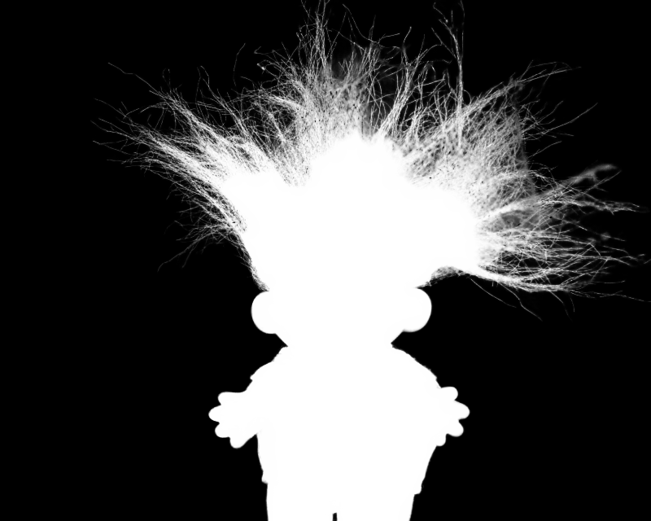
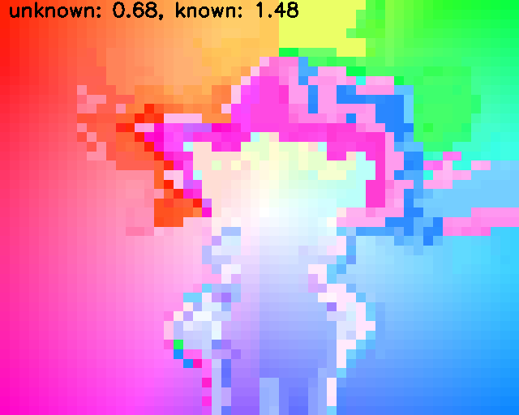
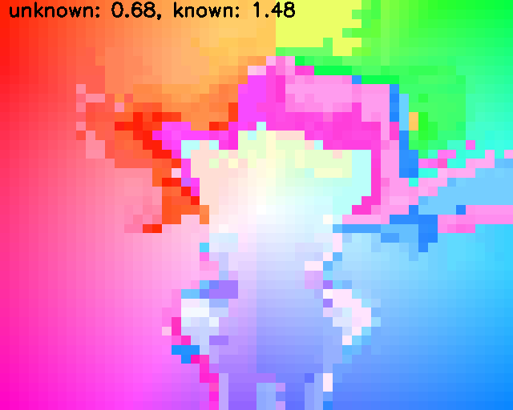

# GCA-Matting: Natural Image Matting via Guided Contextual Attention
The source codes and models of Natural Image Matting via Guided Contextual Attention which will appear in AAAI-20. 

Matting results on test data from alphamatting.com with trimap-user.
<p align="center">
  
  
  
  
  
</p>

## Requirements
#### Packages:
- torch >= 1.1
- tensorboardX
- numpy
- opencv-python
- toml
- easydict
- pprint

GPU memory >= 8GB for inference on Adobe Composition-1K testing set

## Models
**The models pretrained on Adobe Image Matting Dataset are covered by [Adobe Deep Image Mattng Dataset License Agreement](https://drive.google.com/open?id=1MKRen-TDGXYxm9IawPAZrdXQIYhI0XRf) and can only be used and distributed for noncommercial purposes.**

| Model Name  |    Training Data  | File Size   | SAD | MSE | Grad | Conn |
| :------------- |:------|------------:| :-----|----:|----:|----:|
| [ResNet34_En_nomixup](https://drive.google.com/open?id=1kNj33D7x7tR-5hXOvxO53QeCEC8ih3-A) | ISLVRC 2012 | 166 MB |N/A|N/A|N/A|N/A|
| [gca-dist](https://drive.google.com/open?id=1ti_a46lKEH2Hk2fAB11BbyKfYj0rxNK0)      |Adobe Matting Dataset| 96.5 MB      |   0.0091 |35.28|16.92|32.53|
| [gca-dist-all-data](https://drive.google.com/open?id=1GrFrV7guwOQB3N1-bx1iByw_LJNYnIw_) |Adobe Matting Dataset <br> + Composition-1K| 96.5 MB       |  - |-|-|-|

- **ResNet34_En_nomixup**: Model of the customized ResNet-34 backbone trained on ImageNet. Save to `./pretrain/`.
The training codes of ResNet34_En_nomixup and more variants will be released as an independent repository later. You need this checkpoint only if you want to train your own matting model.
- **gca-dist**: Model of the GCA Matting in Table 2 in the paper. Save to `./checkpoints/gca-dist/`.
- **gca-dist-all-data**: Model of the GCA Matting trained on both Adobe Image Matting Dataset and the Composition-1K testing set for alphamatting.com online benchmark. Save to `./checkpoints/gca-dist-all-data/`.

(We removed optimizer state_dict from `gca-dist.pth` and `gca-dist-all-data.pth` to save space. So you cannot resume the training from these two models.)

## Run a Demo on alphamatting.com Testing Set
```bash
python demo.py \
--config=config/gca-dist-all-data.toml \
--checkpoint=checkpoints/gca-dist-all-data/gca-dist-all-data.pth \
--image-dir=demo/input_lowres \
--trimap-dir=demo/trimap_lowres/Trimap3 \
--output=demo/pred/Trimap3/
```
This will load the configuration from _config_ and save predictions in _output_/_config_checkpoint_/*. You can reproduce our alphamatting.com submission by this command.

## Train and Evaluate on Adobe Image Matting Dataset

### Data Preparation
Since each ground truth alpha image in Composition-1K is shared by 20 merged images, we first copy and rename these alpha images to have the same name as their trimaps.
If your ground truth images are in `./Combined_Dataset/Test_set/Adobe-licensed images/alpha`, run following command:
```bash
./copy_testing_alpha.sh Combined_Dataset/Test_set/Adobe-licensed\ images
```
New alpha images will be generated in `Combined_Dataset/Test_set/Adobe-licensed images/alpha_copy`

### Configuration
To be continued :zzz:
### Training
Default training requires 4 GPUs with 11GB memory, and the batch size is 10 for each GPU. You can train the model by 
```bash
./train.sh
```
or
```bash
OMP_NUM_THREADS=2 python -m torch.distributed.launch \
--nproc_per_node=4 main.py \
--config=config/gca-dist.toml
```
### Evaluation
To be continued
